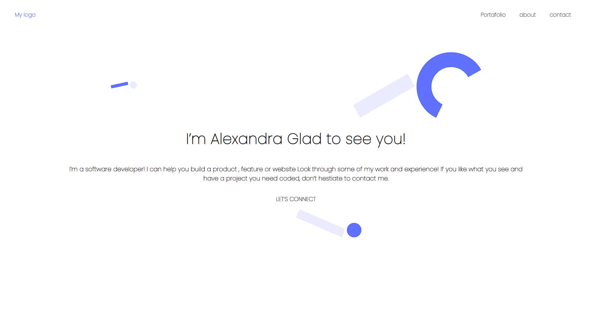

# test program for Microverse
Portfolio: setup and mobile version skeleton
### screenshot

### Prerequisites

Having a working browser.

### Usage

Click on the html file.

### Built With

HTML/CSS.

### Getting Started

this is a website for my Portfolio.

To get a local example of this repository try following is steps:

-Download the repository.

-Click on the index.html.

### Authors

👤 **Author1**

GitHub: @perses1

Twitter: @pablora70339971

LinkedIn: https://www.linkedin.com/in/pablo-ramirez-208265216/

### Show your support

Give a ⭐️ if you like this project!

### 📝 License
This project is MIT license.
